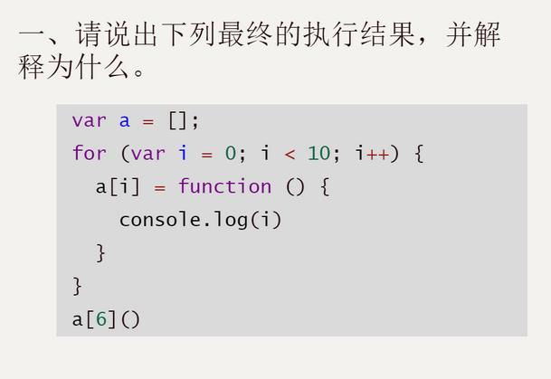
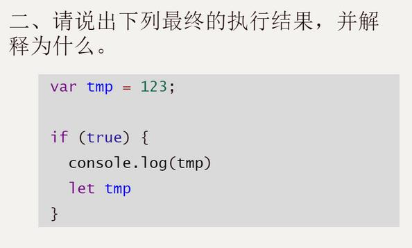
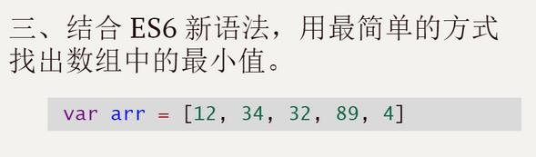
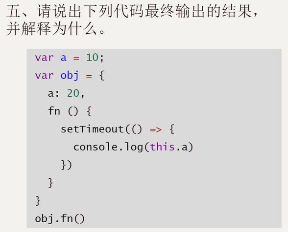
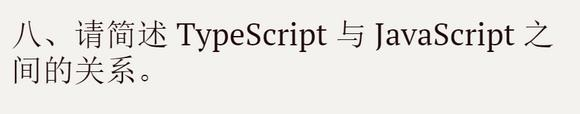

# fed-e-task-01-02

### 简答题



- 结果：10
- 原因：使用了var声明变量i，i就会变成全局变量，每次循环i都会被覆盖，直到循环结束最后一次执行i++，i=10，当执行函数时，获取的i变量其实是这个全局变量i


- 结果： 报错，未初始化tmp
- 原因：let声明变量不会提升，所以声明前使用会报错



```js
var arr = [12, 34, 32, 89, 4]
console.log(arr.sort((a, b) => a - b)[0])
```


- var：
  - 会变量提升
  - 没有块级作用域（用来计数循环变量会被泄露为全局变量）
- let:
  - 不会变量提升
  - 声明前不可使用
  - 声明只对块级作用域生效
- const：
  - 声明变量的同时必须要赋值
  - 声明之后不可修改（对于引用类型不允许修改它指向另一个内存，可以修改当前内存地址中的属性成员）


- 结果：20
- 原因：settimeout使用的是箭头函数，在箭头函数中没有this机制，它内部this指向是当前函数定义时的作用域


- 生成一个唯一值，可用作避免对象属性名重复
- 可模拟实现一个对象的私有成员
- 提供了内置的Symbol常量可以作为内部方法的标识，可实现JS中内置的接口（如：toStringTag、iterator）


- 浅拷贝：创建一个新对象，将原对象属性值原封不动拷贝到新对象上，如果属性是值类型拷贝的就是值，如果属性是引用类型拷贝的是这个属性的内存地址
- 深拷贝：将一个对象从内存中完整拷贝出来，对原对象中的子对象进行递归拷贝，拷贝前后两个对象互不影响


- TypeScript是基于JavaScript语言之上的语言，它是JavaScript的一个超集（扩展集）


- 优点：
  - 更强大的类型系统
  - 对ES6新特性的支持
  - 渐进式语言，即使不使用新的类型系统也可完成开发
  - 自动转换新特性，兼容性好，最低可支持转换到ES3代码
  - 功能强大，生态健全（如开发工具VSCode兼容性）、更加完善
- 缺点：
  - 语言本身多了很多概念，学习成本较高
  - 周期短的项目，TypeScript会增加开发成本，如项目初期会编写很多类型声明


- 原理：内部维护一个引用数，当有一个对象空间一个数值指向它则数值加1，减少时相应的减1，当引用为0时GC开始工作将当前对象空间进行回收
- 优点：
  - 发现垃圾时可立即进行回收
  - 最大限度减少程序暂停
- 缺点：
  - 无法回收循环引用对象
  - 因为需要维护一个引用计数器，导致在执行时间开销大


- 遍历所有对象找到所有活动对象（可达对象）
- 遍历所有的对象，清除没有标记的对象（同时抹掉第一个阶段设置的标记）
- 在清除之前先执行整理，移动对象位置（产生连续地址）
- 回收相应空间


- 回收过程采用的算法：复制算法 + 标记算法
  - 新生代内存空间区分为两个等大小空间（From、To）
  - 使用空间为From，空闲空间为To
  - 将活动对象分配到From空间
  - 当From空间应用到一定程度后触发GC操作，From空间进行标记整理后将活动对象拷贝到To空间
  - 将From内的对象完全释放，此时From与To交换完成
- 回收细节
  - 拷贝过程中发现某一个变量对象也会出现在老生代空间内，会出现晋升操作
  - 晋升就是将新生代对象移动至老生代
- 晋升操作触发条件
  - 触发条件是：新生代对象经过一轮GC还存活的就需要晋升
  - To空间的使用了超过25%，也需要将这一次的活动对象移动至老生代存放


- 何时使用：GC进行第二部分标记（标记子元素可达对象）时，后面交替执行过程都是增量标记
- 原理：将一整段的GC操作，拆分成多个小部分组合完成当前整个回收操作。
- 执行过程：
  - 程序在开始执行过程中触发GC，程序暂停
  - GC开始遍历对象进行标记（只标第一层直接可达对象）
  - 暂停GC，程序继续执行
  - 程序暂停，GC进行二部标记操作（标记子元素可达对象）
  - 暂停GC，继续执行程序
  - 这样交替执行标记完成之后，进行垃圾回收